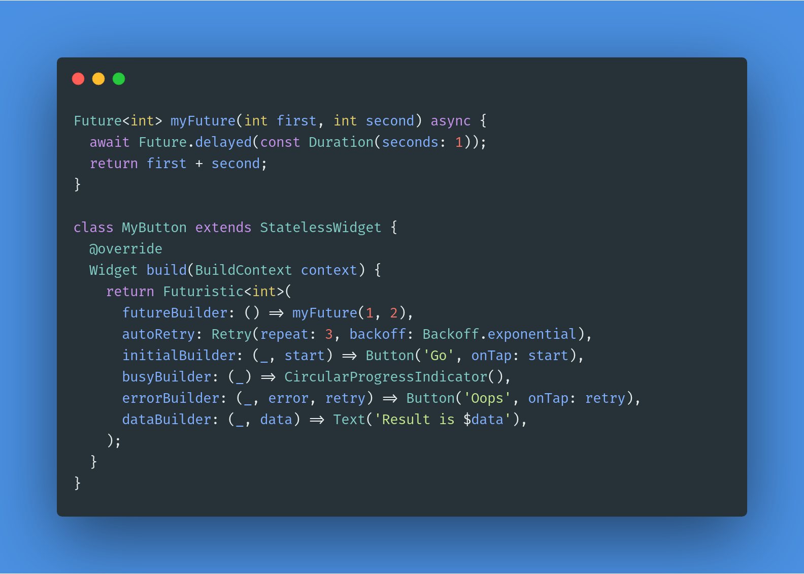

# futuristic

Makes it possible to safely execute and retry a `Future` inside a StatelessWidget.



See the [Mainstream](https://pub.dev/packages/mainstream) package for a similar API for working with `Streams`.

## Problem

If you've ever tried to use the `FutureBuilder` widget in Flutter, you've probably been surprised by its behavior. When used inside a `StatelessWidget`, **it will re-execute its `Future` every time it is rebuilt**. Since a widget can be rebuilt many times in Flutter (including due to hot reload), this can be undesirable if our `Future` calls a non-idempotent REST API endpoint, for example.

```
class Home extends StatelessWidget {
  @override
  Widget build(BuildContext context) {
    return FutureBuilder(
      future: myExpensiveFuture(),  //Will be executed every time Home is rebuilt
      builder: (_context, snapshot) {
        ...
      },
    );
  }
}
```

To execute our `Future` only once, we could use a `StatefulWidget`, but now we have the extra boilerplate of using a `StatefulWidget` and holding onto our `Future` in a state variable.

```
class Home extends StatefulWidget {
  @override
  _HomeState createState() => _HomeState();
}

class _HomeState extends State<Home> {
  Future _future;

  @override
  void initState() {
    super.initState();
    _future = myExpensiveFuture();
  }

  @override
  Widget build(BuildContext context) {
    return FutureBuilder(
      future: _future,  // Will be executed only once
      builder: (_context, snapshot) {
        ...
      },
    );
  }
}
```

## Solution

The problem with `FutureBuilder` is, ironically, that it takes a `Future` instance as its input. Instead, the `Futuristic` widget takes a `Function` that *returns* a `Future` and holds onto it in its own `State`. This means:

* It can be used in a `StatelessWidget`.
* It can let child widgets **start** or **retry** a `Future`.

Additionally, `Futuristic` provides:

* Multiple builder callbacks to provide mutually exclusive `initial/busy/data/error` widget states.
* Optional `onData/onError` callbacks to perform additional actions when a `Future` succeeds or fails.
* Generic type safety for the `data` provided to callbacks. The type parameter `<T>` can be omitted if it can be inferred from the `futureBuilder` function.

## Usage

We can use the `Futuristic` widget to wrap a single component like a button, or even an entire screen.

### Button example

To start executing a `Future` in response to a button press, connect its `onPressed` handler to the `start` function provided in the `initialBuilder` callback.

```
Future<int> myFuture(int first, int second) async {
  await Future.delayed(const Duration(seconds: 1));
  return first + second;
}

class MyButton extends StatelessWidget {
  @override
  Widget build(BuildContext context) {
    return Futuristic<int>(
      futureBuilder: () => myFuture(1, 2),
      initialBuilder: (context, start) => RaisedButton(child: Text('Go'), onPressed: start),
      busyBuilder: (context) => CircularProgressIndicator(),
      errorBuilder: (context, error, retry) => RaisedButton(child: Text('Oops'), onPressed: retry),
      dataBuilder: (context, data) => Text(data.toString()),
    );
  }
}
```
The `futureBuilder` parameter is required.

The `initialBuilder` parameter is required if `autoStart` is false (see example below).

The optional `busyBuilder` displays a widget when the `Future` is busy executing. By default, it shows a centered `CircularProgressIndicator`. By displaying this, we inform the user that the operation is in progress and also prevent the `Future` from being triggered twice accidentally. 

The optional `errorBuilder` displays a widget when the `Future` has failed, typically with an `Error` or `Exception`. This is provided as a parameter, together with a `retry` function that can be called to "retry" the `Future`.

The optional `dataBuilder` displays a widget when the `Future` has succeded. The resulting `T` value of the `Future<T>` is provided as a parameter to the callback. Note that this will be `null` in the case of a `Future<void>`.

### Screen example

To automatically start executing a `Future` upon navigating to a screen, set the `autoStart` parameter to `true` instead of providing an `initialBuilder`. The `busyBuilder` will be displayed immediately.

```
Future<int> myFuture(int first, int second) async {
  await Future.delayed(const Duration(seconds: 1));
  throw Exception('something happened');
  return first + second;
}

class MyScreen extends StatelessWidget {
  @override
  Widget build(BuildContext context) {
    return Futuristic<int>(
      autoStart: true,
      futureBuilder: () => myFuture(1, 2),
      busyBuilder: (context) => CircularProgressIndicator(),
      onError: (error, retry) => showDialog(...),
      onData: (data) => showDialog(...),
    );
  }
}
```

The `futureBuilder` parameter is required.

The optional `onError` callback can be used to handle the error event by displaying an alert dialog or sending to a logging provider, for example. It can be used in place of or together with the `errorBuilder`. A `retry` function is provided as a parameter that can be called to "retry" the `Future`. Be careful not to call `retry` without user interaction to avoid creating an infinite loop. This callback will **not** be retriggered as a result of a widget rebuild.

The optional `onData` callback can be used to handle a successful result by displaying an alert dialog or performing navigation. for example. This can be used in place of or together with the `dataBuilder`. This callback will **not** be retriggered as a result of a widget rebuild.